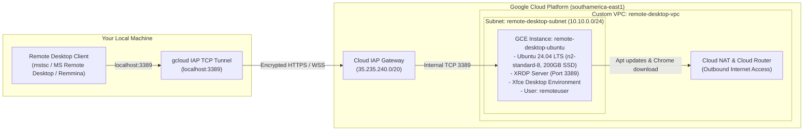

# Google Cloud Linux Remote Desktop on Compute Engine (Terraform)

Automated Terraform configuration to provision a high-performance, secure Linux Remote Desktop VM on **Google Compute Engine (GCE)** using **Ubuntu 24.04 LTS**, **Xfce Desktop Environment**, and **XRDP (Universal Remote Desktop Protocol - Port 3389)**.

This setup allows seamless connection from **any Remote Desktop client** (Windows Remote Desktop Connection, macOS Microsoft Remote Desktop / Jump Desktop, Linux Remmina, mobile apps, etc.) through encrypted **Google Cloud Identity-Aware Proxy (IAP) TCP Tunneling**, eliminating the need for public external IP exposure.

---

## Architecture Overview



### Key Technical Specifications

| Component | Configuration | Description |
| :--- | :--- | :--- |
| **Instance Name** | `remote-desktop-ubuntu` | High-performance GCE VM |
| **Machine Type** | `n2-standard-8` | 8 vCPUs, 32 GB RAM |
| **Region / Zone** | `southamerica-east1` / `southamerica-east1-a` | São Paulo region (configurable) |
| **Boot Disk** | 200 GB SSD (`pd-ssd`) | Fast persistent storage for development & desktop usage |
| **Operating System** | `ubuntu-os-cloud/ubuntu-2404-lts-amd64` | Latest Ubuntu 24.04 LTS Noble Numbat |
| **Desktop Environment** | Xfce (`xfce4-session`) | Lightweight, low-latency, and highly responsive over remote sessions |
| **Remote Protocol** | XRDP & `xorgxrdp` (Port 3389) | Standard RDP protocol compatible with all clients |
| **Preinstalled Apps** | Google Chrome Stable, Git, Htop, PulseAudio | Ready out-of-the-box |
| **Network Architecture** | Custom VPC + Subnet (`10.10.0.0/24`) | Isolated network with Cloud NAT and Cloud Router |
| **Security & Firewalls** | Port 3389 (RDP) & Port 22 (SSH) | Restricted to Google Cloud IAP IP range (`35.235.240.0/20`) |
| **Default User Account** | `remoteuser` | Sudo and ssl-cert permissions granted |
| **Default User Password** | `remoteuser#359` | Configurable via `rdp_password` variable |

---

## Prerequisites

Before deploying, ensure you have:

1. **Terraform CLI** (v1.3.0 or later):
   ```bash
   terraform version
   ```
2. **Google Cloud SDK (`gcloud`)** installed and authenticated:
   ```bash
   gcloud auth application-default login
   gcloud config set project <YOUR PROJECT ID>
   ```
3. **Required IAM Permissions**:
   - `roles/compute.admin` (to create instances, disks, networks, firewalls)
   - `roles/iap.tunnelResourceAccessor` (to open IAP TCP tunnels to instances)
4. **Enabled Google APIs**:
   ```bash
   gcloud services enable compute.googleapis.com iap.googleapis.com --project=<YOUR PROJECT ID>
   ```
5. Any Remote Desktop client on your local computer (e.g., Windows Remote Desktop Connection, Microsoft Remote Desktop for Mac, Remmina for Linux).

---

## Project Structure

```
remote-desktop-vm/
├── main.tf                    # GCE Compute Instance and Boot Disk definition
├── network.tf                 # Custom VPC, Subnet, Cloud Router, Cloud NAT & Firewall Rules
├── variables.tf               # Configurable Terraform input variables & default values
├── outputs.tf                 # Outputs (Instance info, IAP commands, connection instructions)
├── startup-script.sh.tftpl    # Bash template for system upgrades, XRDP, desktop & user setup
├── terraform.tfvars.example   # Example variable overrides file
└── README.md                  # Complete project and operational documentation
```

---

## Deployment Instructions

### Step 1: Clone or Navigate to the Directory

```bash
cd /home/user/remote-desktop-vm
```

### Step 2: Configure Project ID & Custom Variables

Copy the example variables file to `terraform.tfvars`:

```bash
cp terraform.tfvars.example terraform.tfvars
```

Open `terraform.tfvars` and set your Google Cloud **`project_id`** (`<YOUR PROJECT ID>`), along with any other optional settings:

```hcl
project_id          = "<YOUR PROJECT ID>"
region              = "southamerica-east1"
zone                = "southamerica-east1-a"
instance_name       = "remote-desktop-ubuntu"
machine_type        = "n2-standard-8"
rdp_username        = "remoteuser"
rdp_password        = "remoteuser#359"
desktop_environment = "xfce"
```

### Step 3: Initialize and Validate Terraform

```bash
terraform init
terraform validate
```

### Step 4: Provision Infrastructure

```bash
terraform apply
```

Type `yes` when prompted to confirm the deployment.

> **Note**: After `terraform apply` finishes, the VM's automated startup script will take **~2 to 3 minutes** to run `apt-get update`, `apt-get upgrade`, install the desktop environment and XRDP, and configure the user account.

---

## How to Access the Remote Desktop

### 1. Establish the Secure IAP Tunnel

Run the following command in a local terminal window (replace `<YOUR PROJECT ID>` with your Google Cloud Project ID):

```bash
gcloud compute start-iap-tunnel remote-desktop-ubuntu 3389 \
    --local-host-port=localhost:3389 \
    --zone=southamerica-east1-a \
    --project=<YOUR PROJECT ID>
```

> **Keep this terminal window running in the background while you are using the remote desktop session.**

---

### 2. Connect with Your Remote Desktop Client

Open your preferred Remote Desktop client and point it to `localhost:3389`:

#### Windows (Remote Desktop Connection / mstsc)
1. Press `Win + R`, type `mstsc`, and press **Enter**.
2. In the **Computer** field, enter: `localhost:3389`
3. Click **Connect**.
4. When prompted by the certificate warning, click **Yes** / **Continue**.
5. On the XRDP login screen:
   - **Username**: `remoteuser`
   - **Password**: `remoteuser#359`

#### macOS (Microsoft Remote Desktop / Jump Desktop)
1. Open **Microsoft Remote Desktop**.
2. Click **Add PC** (`+`).
3. Set **PC name**: `localhost:3389`
4. Set **Friendly name**: `GCE Remote Desktop (Ubuntu)`
5. Click **Add**, then double-click the new PC card to connect.
6. Enter username `remoteuser` and password `remoteuser#359`.

#### Linux (Remmina)
1. Open **Remmina**.
2. Select **RDP** from the protocol dropdown.
3. In the server field, enter: `localhost:3389`
4. Press **Enter** to connect.
5. Log in with `remoteuser` and `remoteuser#359`.

---

## Alternative: SSH Access via IAP

If you need command-line terminal access to the VM:

```bash
gcloud compute ssh remote-desktop-ubuntu \
    --project=<YOUR PROJECT ID> \
    --zone=southamerica-east1-a \
    --tunnel-through-iap
```

---

## Configuration Reference (`variables.tf`)

| Variable | Type | Default | Description |
| :--- | :--- | :--- | :--- |
| `project_id` | `string` | *(Required)* | Target Google Cloud Project ID |
| `region` | `string` | `"southamerica-east1"` | GCP Region for VPC, Subnet, NAT & VM |
| `zone` | `string` | `"southamerica-east1-a"` | Specific GCP Zone |
| `instance_name` | `string` | `"remote-desktop-ubuntu"` | Name of the Compute Engine VM |
| `machine_type` | `string` | `"n2-standard-8"` | Instance sizing (8 vCPUs, 32GB RAM) |
| `boot_disk_type` | `string` | `"pd-ssd"` | Persistent disk type (`pd-ssd`, `pd-balanced`, `pd-standard`) |
| `boot_disk_size_gb`| `number` | `200` | Disk capacity in GB |
| `boot_disk_image` | `string` | `"ubuntu-os-cloud/ubuntu-2404-lts-amd64"` | Operating system base image |
| `desktop_environment`| `string` | `"xfce"` | Options: `xfce`, `gnome`, `cinnamon`, `kde`, `gnome-classic` |
| `rdp_username` | `string` | `"remoteuser"` | Primary local Linux account username |
| `rdp_password` | `string` | `"remoteuser#359"` | Password for RDP login |
| `vpc_name` | `string` | `"remote-desktop-vpc"` | Name of the custom VPC network |
| `subnet_name` | `string` | `"remote-desktop-subnet"` | Name of the subnetwork |
| `subnet_cidr` | `string` | `"10.10.0.0/24"` | CIDR address space for the subnet |
| `install_chrome_browser` | `bool` | `true` | Automatically installs Google Chrome Stable |

---

## Verification & Troubleshooting

### Check Startup Script Execution Logs
To verify that packages and XRDP finished installing:
```bash
gcloud compute ssh remote-desktop-ubuntu \
    --project=<YOUR PROJECT ID> \
    --zone=southamerica-east1-a \
    --tunnel-through-iap \
    --command="sudo tail -n 50 /var/log/rdp-startup.log"
```

Look for:
```
=================================================================
=== XRDP Remote Desktop Setup Completed Successfully ===
=================================================================
```

### Check XRDP Service Status & Listening Port
```bash
gcloud compute ssh remote-desktop-ubuntu \
    --project=<YOUR PROJECT ID> \
    --zone=southamerica-east1-a \
    --tunnel-through-iap \
    --command="sudo systemctl status xrdp --no-pager && sudo ss -tulpn | grep 3389"
```

### Common Issues

1. **Error: `failed to connect to backend (Failed to connect to port 3389)`**:
   - The VM has just started and is still running its initial `apt upgrade` and package installation. Wait ~1-2 minutes and re-run the `start-iap-tunnel` command.
2. **Permission Denied opening IAP Tunnel**:
   - Ensure your GCP user or service account has the **IAP-secured Tunnel User** role (`roles/iap.tunnelResourceAccessor`):
     ```bash
     gcloud projects add-iam-policy-binding <YOUR PROJECT ID> \
         --member="user:your-email@example.com" \
         --role="roles/iap.tunnelResourceAccessor"
     ```
3. **Local port 3389 already in use**:
   - If port `3389` is occupied by another process on your local machine, bind to a different local port, e.g. `localhost:3390`:
     ```bash
     gcloud compute start-iap-tunnel remote-desktop-ubuntu 3389 \
         --local-host-port=localhost:3390 \
         --zone=southamerica-east1-a \
         --project=<YOUR PROJECT ID>
     ```
     Then connect your RDP client to `localhost:3390`.

---

## Teardown & Resource Cleanup

To destroy all cloud resources created by Terraform (VM, Disks, VPC, Subnet, Router, NAT, and Firewall Rules):

```bash
terraform destroy
```

Type `yes` when prompted.
